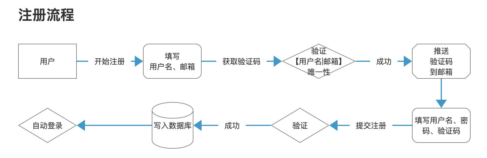

# 高阶之路：从零设计开发一个多端报警系统

## 序 本文目的

教你如何从零开始设计一个系统。

本文会尽量减少代码相关的内容，而侧重于产品与系统设计。

<b>适合阅读人员：会写代码，但不知道代码在系统里为什么这么写。</b>

在线项目预览地址：

【待给】（没给的话回复提醒我一下）

## 第一章 需求的提出

我们在实际业务中，会遇见这样的情况：

1. 希望在项目出现意料之外的错误时（例如服务意外停止），可以自动报警并通知相关负责人员；
2. 某些功能，在出错率超过阈值，自动通知相关人员；
3. 在收到工单，或者工单流程发生变更时，自动通知相关人员；
4. 系统每日周月的自动汇总（例如每日新注册用户、UV、PV等），可以自动将数据推送给相关人员，而非是必须登录信息管理系统才能访问；
5. 通知系统（例如服务部署成功后，推送给相关负责人）；
6. 其他情况；

在以上场景中，我们不讨论如何去获取这些信息（因为这些和场景是高度耦合的）。我们需要在获取到信息后，如何及时快速的通知到相关人员。

因此，我们需要设计一个报警平台，当遇见以上场景后，其他业务系统可以调用这个平台的 api，通知相关负责人。

具体举例如下图

<b>需求明确：希望有一个方便、及时的信息通知系统</b>

## 第二章 需求的完善

第一节中，我们画出了整个系统的流程图，但是这个平台内部怎么构成的，尚未明确。

因此下一步工作是明确平台内部流程，现在我们开始一步一步细化出整个系统流程。

<b>本章的目的是细化整个系统的流程，最终形成一个完整的系统流程图。而具体每部分怎么做，将被放在下一章节</b>

### 第一小节 调用方视角（推送者角色）

整个流程初步构想，是很简单的一件事，就是调用方通过调用平台接口来推送消息，平台方接口被成功调用后，再推送消息给消息接收人。

画出简单的流程图：

在这个过程中，调用方需要关心的是，我能否正确的推送给目标群体。

具体包括 2 点：

1. 数据合法性校验；
2. 接受者获取；

第一点很好理解，我们略过不谈；

第二点接受者获取，是这个系统的重点。他存在两个关键点：

1. 推送者：也就是调用者，我们该怎么明确推送者在系统里的角色，即谁是推送者；
2. 接收者：谁接收推送者的信息，即推送者怎么明确推送信息给谁；

这是系统的第一个难点，看起来很简单，但需要明确主被动关系。为了方便理解，我画了 2 张图：

接受者主动：常见于外网系统，可以有效避免骚扰信息的存在。即避免推送者发送垃圾信息给无关人士。类似

推送者主动：一般在内网系统，我们会选择这种类型，优点的管理方便，典型就是各种邮件组。

本项目代码基于前者开发，但本项目的 PRO 版本会额外添加后者功能，感兴趣的可以关注一下。

此时整理整个流程：

### 第二小节 用户角色

上面的内容，对某些经验还不够丰富的读者，可能有点不好理解。但没关系，让我们来点简单的内容。

从第一小节细化的流程，我们可以很容易总结出两个基本角色：【推送者】【接收者】，根据面向对象的基本玩法，他们必然继承于【用户】这个基类。

我们很容易根据需求，得出最基础的流程如图：

在上面那张图里，为什么我们需要区分角色呢？回想一下我们开始的流程，

我们需要【接收者】订阅【推送者】这个步骤，因此，我们需要能给出【推送者】列表，并且判断当前用户能否订阅。

---

对于普通情况，以上也就够了，但是，扩展性是必须考虑的一件事情。

举个简单的例子，有一种场景很容易想象。

有【系统 A】【系统 B】【系统 C】，订阅这些系统的是不同的人。但这些系统，都归于【用户 M】管理，假如我们要求 用户 M 分别创建三个不同的推送者账号，这显然是不合理的，也很难管理，因此正确的方法是让这三个系统都归属于【用户 M】，形成二级账号。

即，用户注册的账号，作为一级账号。然后创建多个【推送者账号】分别代表【系统 A、B、C】，作为二级账号。

所以根据实际情况，画出第二张图：

用户关系如上图。

### 第三小节 功能模块梳理

在以上，我们初步梳理了流程，但为了实际开发，我们需要将流程细化为具体的功能模块。

整理一下功能模块，如下：

<table>
<tr>
<td>功能模块</td><td>说明</td>
</tr>
<tr>
<td>用户系统</td>
<td>参考第二小节</td>
</tr>

<tr>
<td>数据接收模块</td>
<td>对外暴露接口，负责接收推送者推送的消息</td>
</tr>

<tr>
<td>信息处理模块</td>
<td>负责处理推送者推送的消息，比如说数据校验，已经将合法数据推送到下个模块进行处理</td>
</tr>

<tr>
<td>推送模块</td>
<td>在获取信息、推送者后，查询对应接收者，并将信息推送给接收者列表。后期拓展为多端推送</td>
</tr>

<tr>
<td>订阅管理模块</td>
<td>负责将处理用户订阅、取消订阅的功能。</td>
</tr>

</table>

结合以上功能模块和之前的流程分析，我们可以整理出整个系统的流程，如下图：

## 第三章 功能模块细化

在第二章里，我们根据需求画出了整个系统的流程图，在本章，将会细化每个功能模块，变成可用于开发的说明。

但由于各种限制，因此不会将每个功能做到尽善尽美，举个例子，登录功能如果要深化，那么需要包括例如【防止恶意注册多个账号】、【权限表】、【单点登录】、【防止暴力登录破解密码】等，由于篇幅所限，所以不会添加那些复杂的功能，只会做最基本的功能。

### 第一节 用户系统

根据我们的常识，用户系统通常有以下功能：

1. 注册；
2. 登录；
3. 找回密码/修改密码；
4. 登出：
5. 登录检测；

然后又可以细化：

1. 注册 = 推送注册验证码 + 注册新用户 + 注册完自动登录；
2. 登录：同一账号只允许在同一个地方登录（即登录用户的唯一性），写入 session；
3. 找回密码：找回密码 + 推送验证码 + 修改密码；
4. 登出：清空登录信息；
5. 登录检测：假如当前用户已登录，则自动返回基本登录信息，让前端获取登录状态；

但简化一下（我懒），这个项目只做基本功能，只含注册、登录、登出、登录检测功能。

#### 1. 注册

首先是注册功能，我们首先明确一个用户需要的基本信息：

1. 用户名
2. 邮箱
3. 密码

用户注册时，显然需要提交以上信息。

除此之外，为了防止别人暴力注册多个账号，所以注册时需要提交验证码。而验证码常见有几种：

1. 图形验证码：服务器下发图片给用户，然后用户提交时填写验证码。优点是简单，缺点是不够安全；
2. 邮箱验证码：服务器推送含验证码的邮件给用户，用户注册时提交。优点是验证邮箱的可用性，缺点是不能避免别人注册多个邮箱；
3. 手机验证码：服务器推送验证码短信给用户，注册时提交。优点是避免一个人注册多个账号，缺点是使用邮箱功能的话，需要开发额外的验证邮箱功能，

由于本项目主要推送方式是邮箱，因此采用邮箱验证码。

整理整个注册流程如下图：

PS：用户名之所以要唯一性，是因为之后为了区分用户，需要使用用户名，因此做唯一性处理。

除此之外，为了方便用户管理，我们需要添加更多用户属性字段。（这里数据库模型写一个示例，后面不再猎取，请参考项目里的 ``models.py`` 文件）

<table>
<tr>
    <td>字段</td>
    <td>功能描述</td>
</tr>
<tr>
    <td>username</td>
    <td>用户昵称（2~20位）</td>
</tr>
<tr>
    <td>password</td>
    <td>密码（8~40位），最终以hash的形式存储，固定40位</td>
</tr>
<tr>
    <td>register_date</td>
    <td>用户注册时间，格式（YYYY-MM-DD hh:mm:ss）</td>
</tr>
<tr>
    <td>last_login</td>
    <td>最近一次登录时间</td>
</tr>
<tr>
    <td>is_active</td>
    <td>该账号是否生效</td>
</tr>
<tr>
    <td>email</td>
    <td>注册邮箱</td>
</tr>
<tr>
    <td>user_permission</td>
    <td>用户类型：01.普通（只能接受邮件）02.高级用户（可以接受和创建up主账号）</td>
</tr>
</table>

#### 2. 登录

当注册功能整理好了后，登录就很简单啦。

复杂的登录需要做登录验证码（图片验证码）防止暴力登录等功能，但由于本项目一般用于内网使用，所以就不做了（还是因为我懒）。因此简化一下，只提交两个字段：

1. 用户名；
2. 密码；

流程太简单，就不画图了，手写一下。

用户——》填写用户名、密码——》提交登录——》服务器验证用户名和密码是否正确——》（正确）登录成功——》（错误）记录 ip、时间、账号等写入日志

之所以记录 ip、时间等日志，是为了方便日后功能拓展，例如当某 ip 连续多次登录失败则 ban 掉 ip，某个账号连续多次失败则暂时禁止该账号登录并要求邮箱验证等。

登录成功后，则将用户基本信息（例如 id、用户名，登录时间|过期时间）写入 session。

#### 3. 登出

有了登录系统，那么登出就很好做了。

登录的本质是写入 session，标记该用户为登录。那么登出只需要清空 session 即可。即【提交登出】，无需提交任何字段。

对于 django 来说，清空 session 只需要调用 ``request.session.flush()`` 方法即可。

#### 4. 登录检测

登录检测功能，主要用于判断当前用户是否处于登录状态中。具体来说，分为几部分：

1. 调用该接口：检测当前用户是否在登录状态；如果在登录状态，登录是否过期；如果未过期，返回用户信息；
2. 调用后端接口时，按需检测登录状态（即某些接口需要登录状态才可用）：检测用户登录是否过期，如果过期，拦截并清空 session，返回给用户提示信息；

后者可以参考：``package/request_method_limit.py`` 中的代码。