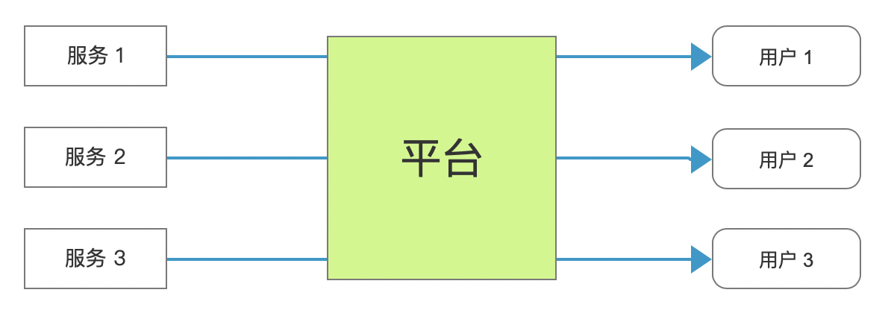
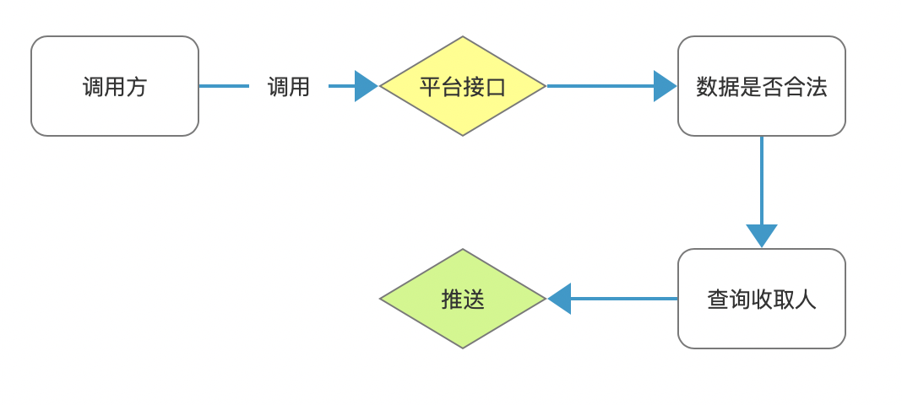
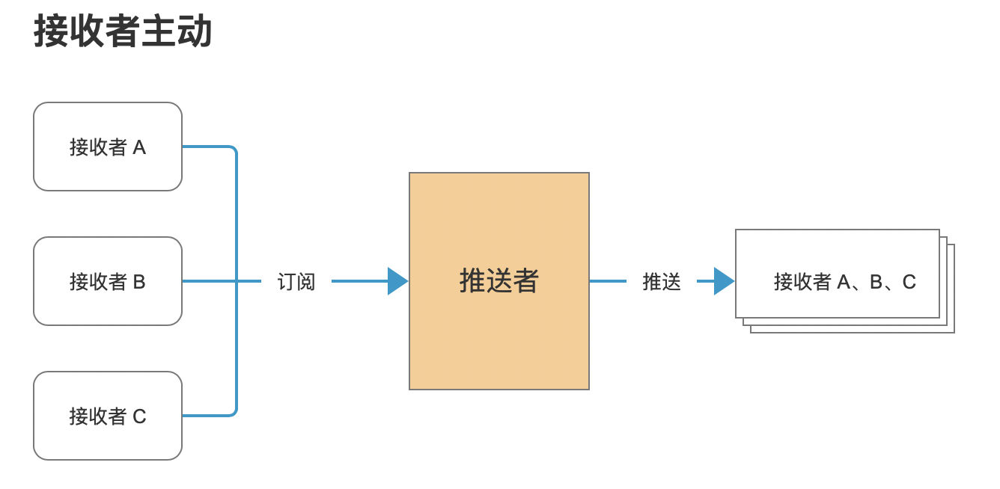
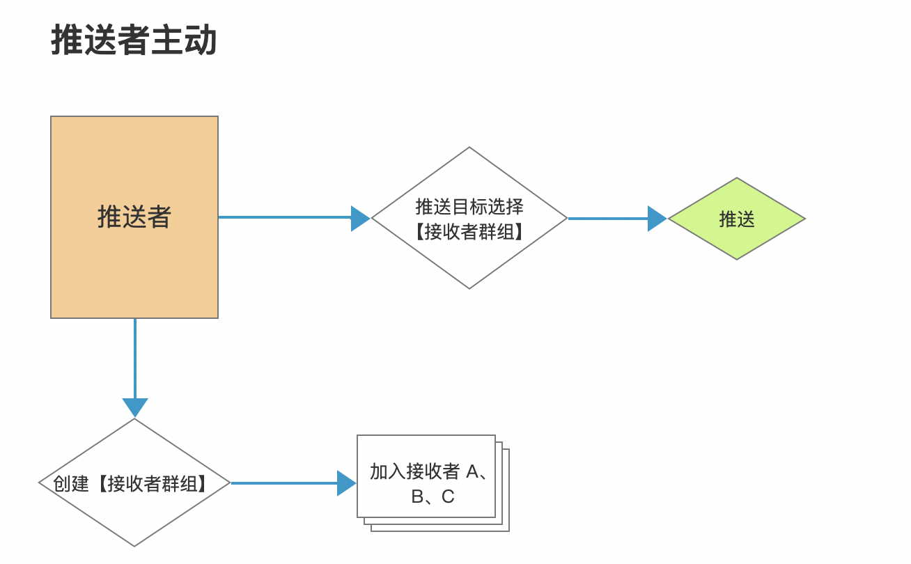
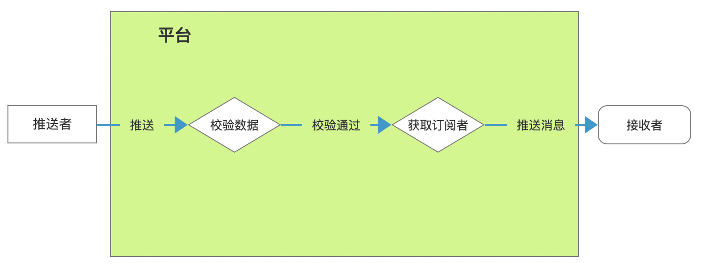
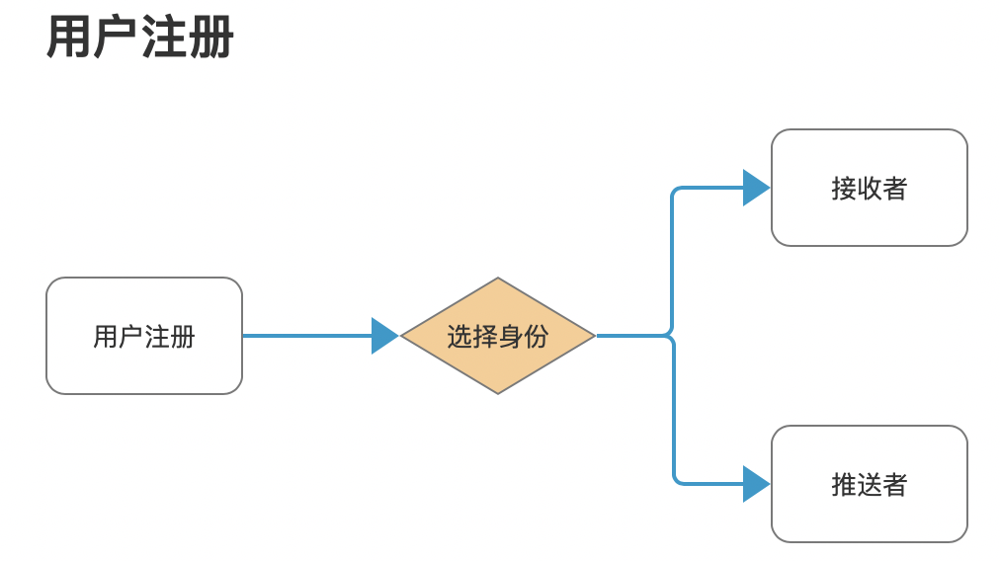
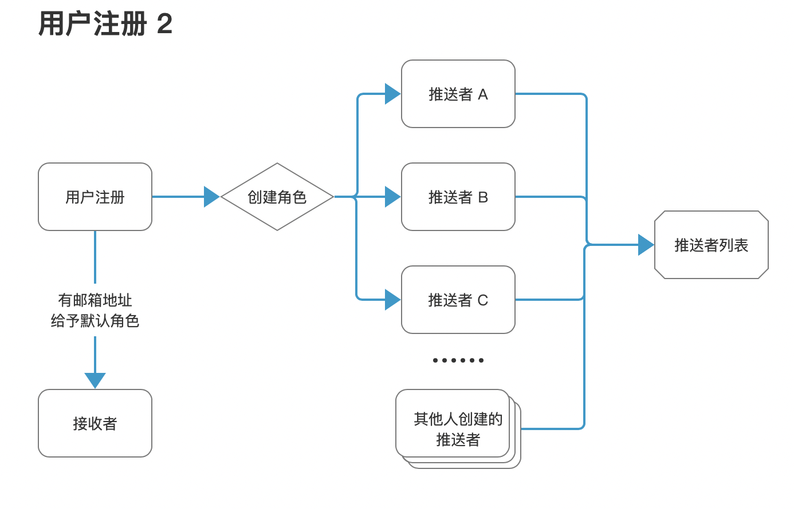
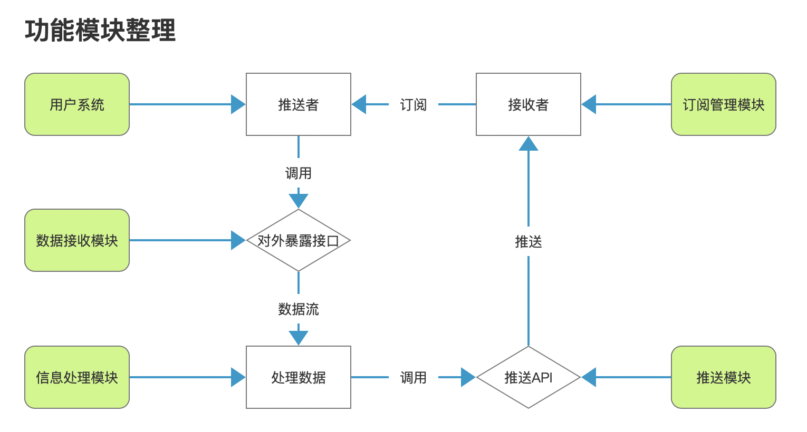

# 高阶之路：从零设计开发一个多端报警系统

## 序 本文目的

教你如何从零开始设计一个系统。

本文会尽量减少代码相关的内容，而侧重于产品与系统设计。

<b>适合阅读人员：会写代码，但不知道代码在系统里为什么这么写。</b>

在线项目预览地址：

【待给】（没给的话回复提醒我一下）

## 第一章 需求的提出

我们在实际业务中，会遇见这样的情况：

1. 希望在项目出现意料之外的错误时（例如服务意外停止），可以自动报警并通知相关负责人员；
2. 某些功能，在出错率超过阈值，自动通知相关人员；
3. 在收到工单，或者工单流程发生变更时，自动通知相关人员；
4. 系统每日周月的自动汇总（例如每日新注册用户、UV、PV等），可以自动将数据推送给相关人员，而非是必须登录信息管理系统才能访问；
5. 通知系统（例如服务部署成功后，推送给相关负责人）；
6. 其他情况；

在以上场景中，我们不讨论如何去获取这些信息（因为这些和场景是高度耦合的）。我们需要在获取到信息后，如何及时快速的通知到相关人员。

因此，我们需要设计一个报警平台，当遇见以上场景后，其他业务系统可以调用这个平台的 api，通知相关负责人。

具体举例如下图

<b>需求明确：希望有一个方便、及时的信息通知系统</b>

## 第二章 需求的完善

第一节中，我们画出了整个系统的流程图，但是这个平台内部怎么构成的，尚未明确。

因此下一步工作是明确平台内部流程，现在我们开始一步一步细化出整个系统流程。

<b>本章的目的是细化整个系统的流程，最终形成一个完整的系统流程图。而具体每部分怎么做，将被放在下一章节</b>

### 第一小节 调用方视角（推送者角色）

整个流程初步构想，是很简单的一件事，就是调用方通过调用平台接口来推送消息，平台方接口被成功调用后，再推送消息给消息接收人。

画出简单的流程图：

在这个过程中，调用方需要关心的是，我能否正确的推送给目标群体。

具体包括 2 点：

1. 数据合法性校验；
2. 接受者获取；

第一点很好理解，我们略过不谈；

第二点接受者获取，是这个系统的重点。他存在两个关键点：

1. 推送者：也就是调用者，我们该怎么明确推送者在系统里的角色，即谁是推送者；
2. 接收者：谁接收推送者的信息，即推送者怎么明确推送信息给谁；

这是系统的第一个难点，看起来很简单，但需要明确主被动关系。为了方便理解，我画了 2 张图：

接受者主动：常见于外网系统，可以有效避免骚扰信息的存在。即避免推送者发送垃圾信息给无关人士。类似

推送者主动：一般在内网系统，我们会选择这种类型，优点的管理方便，典型就是各种邮件组。

本项目代码基于前者开发，但本项目的 PRO 版本会额外添加后者功能，感兴趣的可以关注一下。

此时整理整个流程：

### 第二小节 用户角色

上面的内容，对某些经验还不够丰富的读者，可能有点不好理解。但没关系，让我们来点简单的内容。

从第一小节细化的流程，我们可以很容易总结出两个基本角色：【推送者】【接收者】，根据面向对象的基本玩法，他们必然继承于【用户】这个基类。

我们很容易根据需求，得出最基础的流程如图：

在上面那张图里，为什么我们需要区分角色呢？回想一下我们开始的流程，

我们需要【接收者】订阅【推送者】这个步骤，因此，我们需要能给出【推送者】列表，并且判断当前用户能否订阅。

---

对于普通情况，以上也就够了，但是，扩展性是必须考虑的一件事情。

举个简单的例子，有一种场景很容易想象。

有【系统 A】【系统 B】【系统 C】，订阅这些系统的是不同的人。但这些系统，都归于【用户 M】管理，假如我们要求 用户 M 分别创建三个不同的推送者账号，这显然是不合理的，也很难管理，因此正确的方法是让这三个系统都归属于【用户 M】，形成二级账号。

即，用户注册的账号，作为一级账号。然后创建多个【推送者账号】分别代表【系统 A、B、C】，作为二级账号。

所以根据实际情况，画出第二张图：

用户关系如上图。

### 第三小节 功能模块梳理

在以上，我们初步梳理了流程，但为了实际开发，我们需要将流程细化为具体的功能模块。

整理一下功能模块，如下：

<table>
<tr>
<td>功能模块</td><td>说明</td>
</tr>
<tr>
<td>用户系统</td>
<td>参考第二小节</td>
</tr>

<tr>
<td>数据接收模块</td>
<td>对外暴露接口，负责接收推送者推送的消息</td>
</tr>

<tr>
<td>信息处理模块</td>
<td>负责处理推送者推送的消息，比如说数据校验，已经将合法数据推送到下个模块进行处理</td>
</tr>

<tr>
<td>推送模块</td>
<td>在获取信息、推送者后，查询对应接收者，并将信息推送给接收者列表。后期拓展为多端推送</td>
</tr>

<tr>
<td>订阅管理模块</td>
<td>负责将处理用户订阅、取消订阅的功能。</td>
</tr>

</table>

结合以上功能模块和之前的流程分析，我们可以整理出整个系统的流程，如下图：

## 第三章 功能模块细化